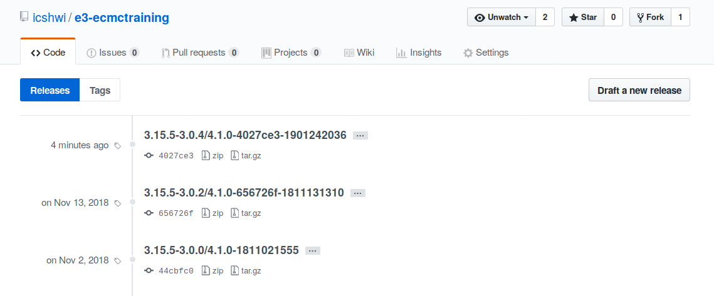
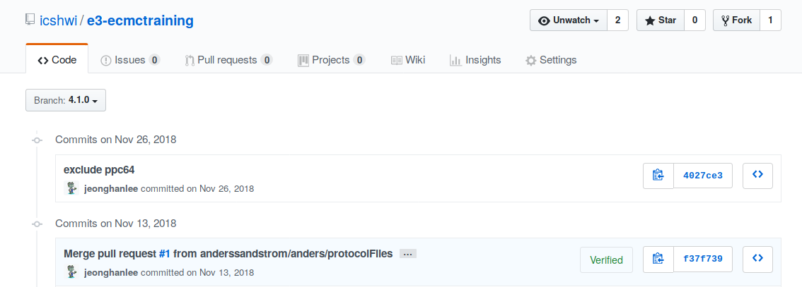
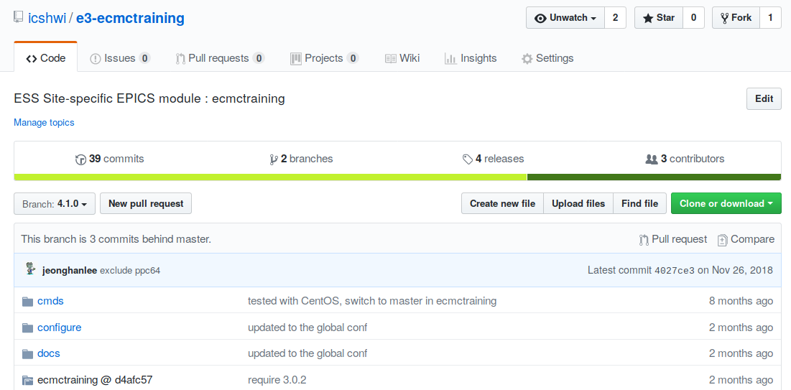

## Create the snapshot release version after the module was updated to use the different module version, different base version, different module version, or all. 

* Check existent tags
```
e3-ecmctraining (master)$ git tag
3.15.5-3.0.0/4.1.0-1811021555
3.15.5-3.0.2/4.1.0-656726f-1811131310
R0.1.0.0
```

* Check the history

```*   4e78cd3 2019-01-24 | Merge pull request #2 from anderssandstrom/master (HEAD -> master, origin/master, origin/HEAD) [Jeong Han Lee]
|\  
| *   2e95c96 2019-01-24 | Merge pull request #1 from anderssandstrom/anders/v4.2.0 [anderssandstrom]
| |\  
|/ /  
| * b13cce2 2019-01-24 | Version 4.2.0 [Anders Sandström]
|/  
* 4027ce3 2018-11-26 | exclude ppc64 [Jeong Han Lee]
*   f37f739 2018-11-13 | Merge pull request #1 from anderssandstrom/anders/protocolFiles [Jeong Han Lee]
|\  
| * 4d351a4 2018-11-13 | Add protocol files. [Anders Sandstrom]
* | 21f0d5f 2018-11-13 | updated to the global conf [Jeong Han Lee]
* | 656726f 2018-11-13 | require 3.0.2 (tag: 3.15.5-3.0.2/4.1.0-656726f-1811131310, origin/4.1.0) [Jeong Han Lee]
|/  
* 44cbfc0 2018-10-16 | Update to ecmctraining,4.1.0 (tag: 3.15.5-3.0.0/4.1.0-1811021555) [Torsten Bögershausen]


```


* Select the release point

We would like to make a tag at 
`4027ce3 2018-11-26 | exclude ppc64 [Jeong Han Lee]`
because we merged 4.2.0 configuration into e3-ecmctraining


```
e3-ecmctraining (master)$ e3ModuleRelease -s 4027ce3 release

>>
  We've found your working environment as follows:
  Working Branch      : master
  Working TARGET_SRC  : 4027ce3
  Working PATH        : /home/jhlee/e3-3.15.5/e3-ecmctraining
>>

Note: checking out '4027ce3'.

You are in 'detached HEAD' state. You can look around, make experimental
changes and commit them, and you can discard any commits you make in this
state without impacting any branches by performing another checkout.

If you want to create a new branch to retain commits you create, you may
do so (now or later) by using -b with the checkout command again. Example:

  git checkout -b <new-branch-name>

HEAD is now at 4027ce3... exclude ppc64

E3 MODULE VERSION  :                                  4.1.0
EPICS BASE VERSION :                                 3.15.5
E3 REQUIRE VERSION :                                  3.0.4

MODULE BRANCH      :                                  4.1.0
MODULE TAG         :  3.15.5-3.0.4/4.1.0-4027ce3-1901242036

>>
  Now you are entering the release e3 module...
>>
  You should aware what you are doing now ....
  If you are not sure, please stop this procedure immediately!

>> Do you want to continue (y/N)? y

>>
  The branch 4.1.0 is found remotely.
fatal: Needed a single revision
  Master 4027ce3 is not the same as Branch 4.1.0 
  Now we are merging from 4027ce3 to 4.1.0 ....
>>
  You should aware what you are doing now ....
  If you are not sure, please stop this procedure immediately!

>> Do you want to continue (y/N)? y

HEAD is now at 4027ce3... exclude ppc64
merge: 4.1.0 - not something we can merge

Did you mean this?
	origin/4.1.0
Previous HEAD position was 4027ce3... exclude ppc64
Branch 4.1.0 set up to track remote branch 4.1.0 from origin.
Switched to a new branch '4.1.0'
Updating 656726f..4027ce3
Fast-forward
 configure/CONFIG              | 18 ++++--------------
 configure/CONFIG_MODULE       | 29 ++++++++---------------------
 configure/CONFIG_MODULE_DEV   | 31 +++++++++----------------------
 configure/DECOUPLE_FLAGS      | 86 --------------------------------------------------------------------------------------
 configure/RELEASE             |  4 +++-
 configure/RELEASE_DEV         |  4 +++-
 configure/RULES               | 18 +++---------------
 configure/module/RULES_DKMS_L | 38 ++++++++++++++++++++++++++++++++++++++
 configure/module/RULES_MODULE | 23 +++++++++++++++++++++++
 docs/.UPDATE_MODULE_LOG       | 14 ++++++++++++++
 ecmctraining.Makefile         |  9 ++++++++-
 11 files changed, 113 insertions(+), 161 deletions(-)
 delete mode 100644 configure/DECOUPLE_FLAGS
 create mode 100644 configure/module/RULES_DKMS_L
 create mode 100644 configure/module/RULES_MODULE
 create mode 100644 docs/.UPDATE_MODULE_LOG
 Now you are committing and creating a tag ....
>>
  You should aware what you are doing now ....
  If you are not sure, please stop this procedure immediately!


>> Do you want to continue (y/N)? y

On branch 4.1.0
Your branch is ahead of 'origin/4.1.0' by 4 commits.
  (use "git push" to publish your local commits)
nothing to commit, working tree clean
>>
  You can push these changes to the remote repository...

  Do you want to continue (y/N)? y
Username for 'https://github.com': jeonghanlee
Password for 'https://jeonghanlee@github.com': 
Total 0 (delta 0), reused 0 (delta 0)
To https://github.com/icshwi/e3-ecmctraining
   656726f..4027ce3  4.1.0 -> 4.1.0
Counting objects: 1, done.
Writing objects: 100% (1/1), 184 bytes | 0 bytes/s, done.
Total 1 (delta 0), reused 0 (delta 0)
To https://github.com/icshwi/e3-ecmctraining
 * [new tag]         3.15.5-3.0.4/4.1.0-4027ce3-1901242036 -> 3.15.5-3.0.4/4.1.0-4027ce3-1901242036
Switched to branch 'master'
Your branch is up-to-date with 'origin/master'.
```


|       |    
| :---: |    
| **Figure 1**  |  


|       |    
| :---: |    
| **Figure 2**  |  


|       |    
| :---: |    
| **Figure 3**  |  
